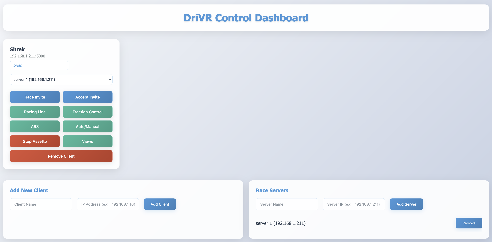

# DriVR - Assetto Corsa Control System

A system for remotely controlling multiple Assetto Corsa client setups through a web dashboard.



## Components

- **Client** (`client/`): Flask server that runs on each sim setup, executes AutoHotkey scripts
- **Dashboard** (`dashboard/`): Web-based control interface for managing multiple clients
- **AHK Scripts** (`ahk/`): AutoHotkey scripts for game interaction

## Quick Start

### 1. Setup Client (on each sim setup)

```sh
cd client
python -m venv venv
.\venv\Scripts\activate
pip install -r requirements.txt

// Set environment variables (PowerShell)
$env:AHK_EXE="C:\Program Files\AutoHotkey\v2\AutoHotKey.exe"

// Run client server (port 5000)
python run.py
```

### 2. Setup Dashboard (central control)

```sh
cd dashboard
pip install -r requirements.txt

// Run dashboard (port 8080)
python run.py
```

### 3. Access Dashboard
Open browser to `http://localhost:8080` and add your client IPs to start controlling them.

## Pre-requisites
* Install [AutoHotkey (AHK)](https://www.autohotkey.com/) on each client machine

# Example Requests

### Close Assetto Corsa
```
curl --location 'http://127.0.0.1:5000/run' \
--header 'Content-Type: application/json' \
--data '{
    "script_name": "send-keystroke.ahk", 
    "args": ["acs.exe", "!{f4}"]
}'
```

### Turn on racing line 
```
curl --location 'http://127.0.0.1:5000/run' \
--header 'Content-Type: application/json' \
--data '{
    "script_name": "send-keystroke.ahk", 
    "args": ["acs.exe", "^i"]
}'
```

### Send race invite 
```
curl --location 'http://127.0.0.1:5000/run' \
--header 'Content-Type: application/json' \
--data '{
    "script_name": "start-process.ahk",
    "args": [
        "C:/Users/gideon/Documents/Content Manager.exe acmanager://race/online/join?ip=192.168.1.211&httpPort=8081"
    ]
}
'
```

# Example Errors 

Sending a keystroke to a process that doesn't exist

```
// Request body 
{
    "script_name": "send-keystroke.ahk", 
    "args": ["acs.exe", "^i"]
}

// Response
{
    "status": "error",
    "stderr": "Process Content Manager.exe is not running.",
    "stdout": ""
}
```