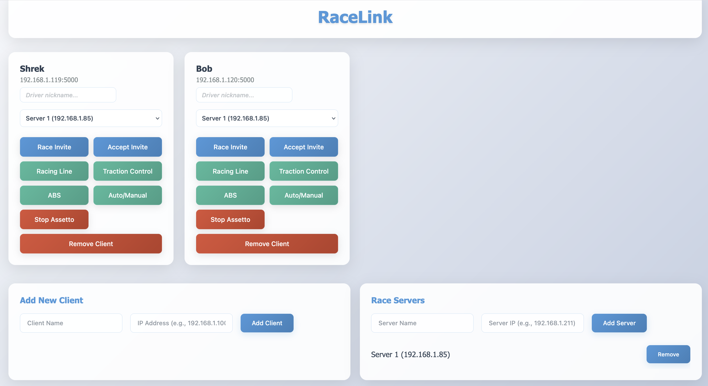

# Sim Racing Control System

Remote control multiple racing sim setups from a single web dashboard. Send commands, toggle settings, and manage racing sessions across your network.



## How It Works

- **Client**: Runs on each sim setup, executes commands via AutoHotkey
- **Dashboard**: Web interface to control all connected clients
- **Commands**: Pre-configured actions like race invites, setting toggles, game controls

## Setup

### Prerequisites
- [AutoHotkey v2](https://www.autohotkey.com/) installed on each sim setup
- Python 3.7+ on all machines

### 1. Client Setup (each sim setup)

```powershell
pip install -r .\requirements.txt
cd .\client\

# Set AutoHotkey path
$env:AHK_EXE="C:\Program Files\AutoHotkey\v2\AutoHotKey.exe"

# Start client (port 5000)
python .\run.py
```

### 2. Dashboard Setup (control machine)

```powershell
pip install -r .\requirements.txt
cd .\dashboard\

# Start dashboard (port 8080)
python .\run.py
```

### 3. Configuration

Configure clients and servers by editing the JSON files in `dashboard/app/static/`:

**clients-config.json**: Define your sim rigs
```json
{
  "clients": [
    {
      "name": "Rig 6",
      "ip": "192.168.1.106",
      "selectedServer": null
    }
  ]
}
```

**servers-config.json**: Define available race servers
```json
{
  "servers": [
    {
      "id": 1,
      "name": "Main Race Server", 
      "ip": "192.168.1.100",
      "port": "9600",
      "password": ""
    }
  ]
}
```

### 4. Connect & Control

1. Open `http://localhost:8080`
2. Clients load automatically from configuration
3. Use buttons to control each setup remotely


